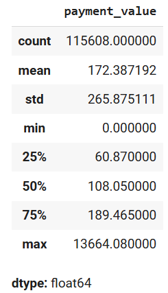

# OLIST

# Table of Contents

1. **[SCOPE](#scope)**
   - [Project Objective](#project-objective)
   - [Technologies Used](#technologies-used)
   - [About the company](#About-the-company)
   - [Dataset](#dataset)
2. **[DATA LOADING](#data-loading)**
3. **[DATA CLEANING](#data-cleaning)**
   - [Missing Values](#missing-values)
   - [Duplicates](#duplicates)
   - [Merge Dataframe](#merge-dataframe)
4. **[EXPLORATORY DATA ANALYSIS (EDA)](#exploratory-data-analysis-(eda))**
   - [Initial Data Overview](#initial-data-overview)
   - [Evaluate sales performance and Analyze customer purchasing behavior](#Evaluate-sales-performance-and-Analyze-customer-purchasing-behavior)
   - [Identify potential issues](#Identify-potential-issues)
5. **[CONCLUSION](#conclusion)**

# SCOPE
You’ve just joined Olist as a Junior Data Analyst on the Sales Optimization team. Olist is a major e-commerce platform in Brazil, known for connecting businesses with customers online. To stay ahead in a competitive market, Olist needs to enhance customer experience, optimize seller performance, improve logistics. You’ve been given historical orders, customers, products, sellers and geolocation data. Your goal is to uncover data-driven insights that support these key focus areas—such as analyzing buyer behavior, identifying top-performing products, and identifying any potential issues. But first, Olist executives must approve your recommendations, so they must be backed up with compeling data insights and professional data visualizations. 

## Project Objective
The project aims to ensure the objectives of the business analysis project for sales management—such as optimizing the sales process, increasing revenue and profit, gaining deeper customer insights, enhancing advertising effectiveness, improving user experience, optimizing inventory management, and forecasting market trends. Key objectives include:

- **Analyze customer behavior** : Include behavior patterns such as purchase frequency, average order value, and popular product categories.
- **Evaluate sales performance**: Assess overall revenue, revenue by individual products or product groups, and revenue over time.
- **Identify potential issues**: Propose improvements that enhance performance and reduce operational costs.

## Technologies Used  
- Python (Pandas, NumPy, Matplotlib, Seaborn)    
- SQL 
- Jupyter Notebook / Google Colab 

## About the company
OLIST is a prominent e-commerce platform in Brazil, offering solutions that support businesses in selling online and managing their e-commerce operations. As an integrated multi-channel platform, OLIST enables businesses to manage and sell products across multiple e-commerce marketplaces simultaneously. This includes major platforms in Brazil such as Mercado Livre, Americanas, and others, helping businesses expand their customer reach.
Moreover, the platform facilitates product listing and inventory management by allowing users to easily upload and manage products across different sales channels from a single interface. OLIST also provides tools to synchronize product information and track inventory in real time.

## Dataset

- Source: [Brazilian E-Commerce Public Dataset by Olist](https://www.kaggle.com/datasets/olistbr/brazilian-ecommerce)

> The dataset has information of 100k orders from 2016 to 2018 made at multiple marketplaces in Brazil. Its features allows viewing an order from multiple dimensions: from order status, price, payment and freight performance to customer location, product attributes and finally reviews written by customers, a geolocation dataset that relates Brazilian zip codes to lat/lng coordinates.
Here's the Entity-Relationship Diagram of the resulting SQLite database:
<center>
      
  </center>

# DATA LOADING

  ```python
import pandas as pd
import numpy as np
from datetime import timedelta
import os
import seaborn as sns
from matplotlib import pyplot as plt
plt.style.use('ggplot')
import plotly.graph_objects as go
from matplotlib.colors import LinearSegmentedColormap
```
```python
orders = pd.read_csv("/content/drive/MyDrive/archive/olist_orders_dataset.csv")
order_items = pd.read_csv("/content/drive/MyDrive/archive/olist_order_items_dataset.csv")
payments = pd.read_csv("/content/drive/MyDrive/archive/olist_order_payments_dataset.csv")
reviews = pd.read_csv("/content/drive/MyDrive/archive/olist_order_reviews_dataset.csv")
customers = pd.read_csv("/content/drive/MyDrive/archive/olist_customers_dataset.csv")
sellers = pd.read_csv("/content/drive/MyDrive/archive/olist_sellers_dataset.csv")
products = pd.read_csv("/content/drive/MyDrive/archive/olist_products_dataset.csv")
geolocation = pd.read_csv("/content/drive/MyDrive/archive/olist_geolocation_dataset.csv")
categories = pd.read_csv("/content/drive/MyDrive/archive/product_category_name_translation.csv")

dfs = {
    "orders": orders,
    "order_items": order_items,
    "payments": payments,
    "reviews": reviews,
    "customers": customers,
    "sellers": sellers,
    "products": products,
    "geolocation": geolocation,
    "categories": categories
}

for name, df in dfs.items():
    print(f"\n\n  ---  for table «{name.upper()}» shape is {df.shape}  ---\n")
    print(f"First 2 rows:\n{df.head(2)}\n")
    print(f"Column Names:\n{df.columns.tolist()}\n")
    print(f"Data Types:\n{df.dtypes}")
```
- **Orders** table:
<center>
      
  </center>
  
- **Order_items** table:
<center>
      
  </center>

- **Payments** table:
<center>
      
  </center>

- **Reviews** table:
<center>
      
  </center>

- **Customers** table:
<center>
      
  </center>

- **Sellers** table:
<center>
      
  </center>

- **Products** table:
<center>
      
  </center>


- **Geolocation** and **Categories** tables:
<center>
      
  </center>
  
# DATA CLEANING

## Missing Values:
- Check the missing values. columns that are missing by more than 50 percent will be considered to be removed.
```python
def missing_data_summary(df, threshold=0):
    return (pd.DataFrame(df.isna().sum())
            .reset_index()
            .rename(columns={'index': 'Column', 0: 'mis_count'})
            .query('mis_count > 0')  # Only include columns with missing values
            .assign(Missing_Percentage=lambda x: x['mis_count'] / df.shape[0] * 100)
            .query(f'Missing_Percentage > {threshold}')  # Filter by threshold
            .sort_values('mis_count', ascending=False)
            .reset_index(drop=True))

missing_data_summaries = {}

for name, df in dfs.items():
    missing_data_summaries[name] = missing_data_summary(df,51)

# Print the results for each DataFrame
for name, summary in missing_data_summaries.items():
    print(f"Missing data summary for {name}:")
    print(summary)
    print("\n")
```
<center>
      
  </center>
  
```python
reviews = reviews.drop('review_comment_title', axis=1)
```
```python
for name, df in dfs.items():
    print(f"\n{name.upper()} - NULL values:")
    print(df.isnull().sum(),'\n')
```
<center>
      
  </center>
  
<center>
      
  </center>


1. Handle missing data in **ORDERS** table:

```python
date_cols = ['order_purchase_timestamp', 'order_approved_at', 
             'order_delivered_carrier_date', 'order_delivered_customer_date',
             'order_estimated_delivery_date']
for col in date_cols:
    orders[col] = pd.to_datetime(orders[col], errors='coerce')
```

- Column **order_approved_at**

```python
orders[orders["order_approved_at"].isnull()]["order_status"].value_counts()
```
<center>
      
  </center>
  
```python
orders[orders["order_approved_at"].isnull() & (orders["order_status"] == "delivered")]["order_id"].values
```
<center>
      
  </center>
  
```python
payments[payments["order_id"].isin(['e04abd8149ef81b95221e88f6ed9ab6a',
       '8a9adc69528e1001fc68dd0aaebbb54a',
       '7013bcfc1c97fe719a7b5e05e61c12db',
       '5cf925b116421afa85ee25e99b4c34fb',
       '12a95a3c06dbaec84bcfb0e2da5d228a',
       'c1d4211b3dae76144deccd6c74144a88',
       'd69e5d356402adc8cf17e08b5033acfb',
       'd77031d6a3c8a52f019764e68f211c69',
       '7002a78c79c519ac54022d4f8a65e6e8',
       '2eecb0d85f281280f79fa00f9cec1a95',
       '51eb2eebd5d76a24625b31c33dd41449',
       '88083e8f64d95b932164187484d90212',
       '3c0b8706b065f9919d0505d3b3343881',
       '2babbb4b15e6d2dfe95e2de765c97bce'])]
```
<center>
      
  </center>
  
```python
# Calculate average time from purchase to approval
avg_approval_time = (orders['order_approved_at'] - orders['order_purchase_timestamp']).mean()

# Impute missing approval times with purchase time + average
orders['order_approved_at'] = orders['order_approved_at'].fillna(
    orders['order_purchase_timestamp'] + avg_approval_time
)
```
```python
orders[orders["order_approved_at"].isnull()]["order_status"].value_counts()
```
<center>
      
  </center>

- Column **order_delivered_carrier_date**

```python
orders[orders["order_delivered_carrier_date"].isnull()]["order_status"].value_counts()
```
<center>
      
  </center>
  
```python
orders[(orders["order_delivered_carrier_date"].isnull()) & (orders["order_status"] == "delivered")]
```
<center>
      
  </center>
  
```python
orders = orders[orders['order_id'] != '2d858f451373b04fb5c984a1cc2defaf']
delivered1 = orders[orders['order_status'] == 'delivered']
avg_approval_to_carrier = (pd.to_datetime(delivered['order_delivered_carrier_date']) - 
                          pd.to_datetime(delivered['order_approved_at'])).mean()
orders['order_delivered_carrier_date'].fillna(pd.to_datetime(orders['order_approved_at']) + avg_approval_to_carrier, inplace=True)
```

- Column **order_delivered_customer_date**

```python
orders[orders["order_delivered_customer_date"].isnull()]["order_status"].value_counts()
```
<center>
      
  </center>
  
```python
orders[(orders["order_delivered_customer_date"].isnull()) & (orders["order_status"] == "delivered")]
```
<center>
      
  </center>
  
```python
delivered2 = orders[orders['order_status'] == 'delivered']
avg_carrier_to_delivery = (pd.to_datetime(delivered['order_delivered_customer_date']) - 
                          pd.to_datetime(delivered['order_delivered_carrier_date'])).mean()
orders['order_delivered_customer_date'].fillna(pd.to_datetime(orders['order_delivered_carrier_date']) + avg_carrier_to_delivery, inplace=True)
```
```
orders.isnull().sum()
```
<center>
      
  </center>

2. Handle missing data in **PRODUCTS** table:

```python
products = products.drop(['product_name_lenght', 'product_description_lenght', 'product_photos_qty'], axis=1)
products['product_category_name'] = products['product_category_name'].fillna('unknown')
products['product_weight_g'] = products['product_weight_g'].fillna(products['product_weight_g'].median())
products['product_length_cm'] = products['product_length_cm'].fillna(products['product_length_cm'].median())
products['product_height_cm'] = products['product_height_cm'].fillna(products['product_height_cm'].median())
products['product_width_cm'] = products['product_width_cm'].fillna(products['product_width_cm'].median())
```
```
products.isnull().sum()
```
<center>
      
  </center>
  
## Duplicates:

```python
for name, df in dfs.items():
    print(f"\n{name.upper()} - Duplicates: {df.duplicated().sum()}")
```
<center>
      
  </center>
  
```python
geolocation.duplicated().value_counts()
```
<center>
      
  </center>
  
```python
geolocation = geolocation.drop_duplicates()
geolocation.duplicated().sum()
```
<center>
      
  </center>

## Merge Dataframe

```python
df = orders.merge(order_items, on='order_id', how='inner')
df = df.merge(payments, on='order_id', how='inner', validate='m:m')
df = df.merge(reviews, on='order_id', how='inner')
df = df.merge(products, on='product_id', how='inner')
df = df.merge(customers, on='customer_id', how='inner')
df = df.merge(sellers, on='seller_id', how='inner')
df = df.merge(categories, on='product_category_name', how='inner')
df.info()
```
<center>
      
  </center>
  
```python
# Create useful features from order_purchase_timestamp
df['day_of_week_int'] = df['order_purchase_timestamp'].dt.weekday + 1  # Day of week as integer (1 = Monday, etc.)
df['hour'] = df['order_purchase_timestamp'].dt.hour                    # Hour of day
df['month'] = df['order_purchase_timestamp'].dt.month                  # Month as integer
df['year'] = df['order_purchase_timestamp'].dt.year                    # Year as integer
df['date'] = df['order_purchase_timestamp'].dt.to_period('M')          # Monthly period for time series analysis

# Calculate delivery time in days
df['delivery_time'] = (df['order_delivered_customer_date'] - df['order_purchase_timestamp']).dt.days
```
```python
df.isnull().sum()
```
<center>
      
  </center>

<center>
      
  </center>
  
```python
geo_avg = geolocation.groupby('geolocation_zip_code_prefix')[['geolocation_lat', 'geolocation_lng']].mean().reset_index()

df = df.merge(geo_avg, how='left', left_on='customer_zip_code_prefix', right_on='geolocation_zip_code_prefix')

df.isna().sum()
```
<center>
      
  </center>
  
```python
median_coords = df.groupby('customer_city')[['geolocation_lat', 'geolocation_lng']].transform('median')
df[['geolocation_lat', 'geolocation_lng']] = df[['geolocation_lat', 'geolocation_lng']].fillna(median_coords)
df.isna().sum()
```
<center>
      
  </center>

```python
median_lat = df['geolocation_lat'].median()
median_lng = df['geolocation_lng'].median()

df['geolocation_lat'] = df['geolocation_lat'].fillna(median_lat)
df['geolocation_lng'] = df['geolocation_lng'].fillna(median_lng)
df.isnull().sum()
```
<center>
      
  </center>
  
```python
df.duplicated().sum()
```
<center>
      
  </center>

# EXPLORATORY DATA ANALYSIS (EDA)

## I. Initial Data Overview 

```python
df.info()
```
<center>
      
  </center>

```python
df.nunique()
```
<center>
      
  </center>

<center>
      
  </center>
  
```python
df['price'].describe()
```
<center>
      
  </center>
  
```python
df['payment_value'].describe()
```
<center>
      
  </center>
  
```python
df['payment_type'].value_counts()
```
<center>
      
  </center>
  
```python
df['review_score'].value_counts()
```
<center>
      
  </center>
  
```python
print(df['order_purchase_timestamp'].min(), df['order_purchase_timestamp'].max())
```
<center>
      
  </center>
  
```python
# Select relevant features for correlation analysis
correlation_features = df[['price', 'review_score', 'delivery_time',
                            'payment_value', 'freight_value',
                            'payment_installments', 'order_item_id',
                            'hour', 'month']]

# Calculate the correlation matrix
correlation = correlation_features.corr()

# Define the custom colormap
custom_cmap = LinearSegmentedColormap.from_list("custom_cmap", ['green', 'white', 'darkblue'])

plt.figure(figsize=(10, 8))
sns.heatmap(correlation, annot=True, cmap=custom_cmap, vmin=-1, vmax=1, fmt=".2f", linewidths=.5)
plt.title('Correlation Heatmap')
plt.show()
```
<center>
      
  </center>

## II. Evaluate sales performance and Analyze customer purchasing behavior

### 1. Monthly sales trend
```python
# Monthly sales trend
monthly_sales = df.groupby(df['order_purchase_timestamp'].dt.to_period('M')).agg({'price': 'sum'})

# Set the figure size for better visibility
plt.figure(figsize=(12, 6))

# Plot the data with custom colors
plt.plot(monthly_sales.index.astype(str), monthly_sales['price'],
         marker='o', linestyle='-', color='blue', linewidth=2)

# Adding titles and labels
plt.title('Monthly Sales Trend', fontsize=16, fontweight='bold')
plt.xlabel('Month', fontsize=14)
plt.ylabel('Total Sales', fontsize=14)

# Customize the ticks
plt.xticks(rotation=45, fontsize=12)
plt.yticks(fontsize=12)

# Add gridlines for better readability
plt.grid(visible=True, linestyle='--', alpha=0.7)

# Show the plot
plt.tight_layout()
plt.show()
```
<center>
      
  </center>
  
- From **September 2016** to around **mid-2018**, there's a clear **upward trend** in **total sales**, indicating **consistent growth** over time.
- The **highest peak** occurs around **November 2017**, where **sales** exceed **1 million units**. This could be linked to **seasonal events** like **Black Friday** or **holiday shopping**.
- There's a **dramatic drop** in sales in **September 2018**. Possible reason is **missing data**.

### 2. The frequency of orders per day

```python
# Group by timestamp and aggregate order counts
daily_orders = df.groupby(df['order_purchase_timestamp'].dt.floor('D'))['order_id'].count().reset_index()

# Convert 'order_purchase_timestamp' to matplotlib dates
dates = mdates.date2num(daily_orders['order_purchase_timestamp'])

# Create the plot
fig, ax = plt.subplots(figsize=(14, 6))
ax.plot(dates, daily_orders['order_id'],color='blue')

# Format x-axis to display dates
date_format = mdates.DateFormatter('%Y-%m')
ax.xaxis.set_major_formatter(date_format)
ax.xaxis_date()

# Set labels and title
plt.ylabel('Number of orders')
plt.title('Number of orders per day', fontsize=16, fontweight='bold')
plt.xlabel('Month', fontsize=14)

# Add grid and show the plot
plt.grid(visible=True, linestyle='--', alpha=0.7)
plt.tight_layout()
plt.show()
```
<center>
      
  </center>
  
- There's a **large spike** of **orders** around **Christmas**, specifically on the **24th of December**.
- The **number of orders** also seems to be **increasing steadily over time** as Olist's business grows. Also notice how there's very **few data** at the **start and end** of the **timespan** covered by the dataset, so I'll exclude these dates from some of my next queries.

### 3. Heatmap of order volume by Day of Week and Hour of Day
How are orders distributed over the week? Are more orders placed on weekends? How about during the day? Do customers place more orders in the evening? We can answer these questions using a heatmap that plots the distribution of both on a grid. 
To plot a heatmap we need a matrix of counts of orders, where rows represent days of the week and columns represent hours of the day:
```python
# Convert day_of_week_int to day names
day_map = {
    1: 'Mon',
    2: 'Tue',
    3: 'Wed',
    4: 'Thu',
    5: 'Fri',
    6: 'Sat',
    7: 'Sun'
}

df['day_of_week_name'] = df['day_of_week_int'].map(day_map)

# Create a pivot table: count number of orders by day and hour
pivot_df = df.pivot_table(
    index='day_of_week_name',
    columns='hour',
    values='order_id',
    aggfunc='count',
    fill_value=0
)

# Reorder the days properly (Sun -> Sat)
ordered_days = ['Sun', 'Mon', 'Tue', 'Wed', 'Thu', 'Fri', 'Sat']
pivot_df = pivot_df.reindex(ordered_days)

# Display the result table
print(pivot_df)
```
<center>
      
  </center>
  
With the data matrix ready, we can use seaborn to create the heatmap:
```python
fig, ax = plt.subplots(figsize=(14, 6))
sns.heatmap(pivot_df, cmap='YlGnBu', cbar=False)
mean_orders = pivot_df.mean().mean()
for i in range(len(pivot_df)):
    for j in range(len(pivot_df.columns)):
        text_color = 'white' if pivot_df.iloc[i, j] > mean_orders else 'black'
        ax.text(j+0.5, i+0.5, int(pivot_df.iloc[i, j]),
            color=text_color, fontsize=10, ha="center", va="center")
plt.title("Number of orders by day of the week and hour of the day")
plt.xlabel("Hour of the day")
plt.ylabel("")
plt.show()
```
<center>
      
  </center>
  
- **Most orders** were placed during the **weekdays** from **10 AM to 4 PM** with a **small dip** in sales around **12 PM** due to **lunchtime**.
- Customers also order through Olist in the **evenings** around **9 PM** from **Sunday to Thursday**. **Saturday** is the day with the **fewest orders**, although it's still quite busy.
- The **least busy** time of the day is from **3 to 5 AM**, although there are still a few orders during that time.

### 3. Order prices

What's the average value of an order? Does Olist handle transactions of items of really low or really high value? 
Let's answer our first question then: What's the average order price, considering both the cost of products and shipping? To start, let's find the orders with the lowest and the highest costs:
```python
df['order_price'] = df['price'] + df['freight_value']

# Group by order_id and sum order_price
order_price_df = df.groupby('order_id')['order_price'].sum().reset_index()

# Aggregate min, avg (rounded), and max
min_order_price = order_price_df['order_price'].min()
avg_order_price = round(order_price_df['order_price'].mean(), 2)
max_order_price = order_price_df['order_price'].max()

# Display results
print("Min Order Price:", min_order_price)
print("Avg Order Price:", avg_order_price)
print("Max Order Price:", max_order_price)
```
<center>
      
  </center>
  
The average order price is 160.58 BRL, which is around the cost of a pair of sports shoes in 2017 in Brazil. As we can see, the most expensive order is 13664.08, almost 100 times the average, meaning we probably have a right-tailed distribution, where most of the orders have low cost but there are orders with a very high cost. 
Let's see the variation in prices, this time separating product cost and shipping cost. To start, let's aggregate the product cost and shipping cost for each order:

```python
delivered_df = df[df['order_status'] == 'delivered']

#Group by 'order_id' and sum 'price' and 'freight_value'
summary_df = delivered_df.groupby('order_id').agg(
    product_cost=('price', 'sum'),
    shipping_cost=('freight_value', 'sum')
).reset_index()

# Display result
print(summary_df)
```
<center>
      
  </center>
  
Let's plot a histogram of each cost. Since the cost can take a huge range of values but most orders have a low cost, I'll limit each plot's x-axes to 500 reals and 80 reals respectively to highlight the distribution of the most common values:
```python
plt.figure(figsize=(15, 6))
# Histogram for total product cost
plt.subplot(1, 2, 1)
plt.hist(summary_df['product_cost'], bins=1000, color='#skyblue')
plt.title('Product cost for orders < R$500')
plt.xlabel('Product cost (Brazilian reals)')
plt.ylabel('Frequency')
plt.xlim([0, 500])
# Histogram for total shipping cost
plt.subplot(1, 2, 2)
plt.hist(summary_df['shipping_cost'], bins=800, color='#springgreen')
plt.title('Shipping cost for orders < R$80')
plt.xlabel('Product cost (Brazilian reals)')
plt.xlim([0, 80])
plt.show()
```
<center>
      
  </center>
  
- The value of products in an order can vary wildly and take from very low to very high values, although most orders contain products with a total cost under 200 reals.
- Shipping cost is usually between 7-20 reals, and rarely below that, but it can also take a wide range of much higher values.

### 4. Payment behavior analysis

```python
df['payment_type'].nunique()
```
<center>
      
  </center>
  
Boleto is a widely used payment method in Latin America, particularly in Brazil. Introduced in 1993, it was designed to facilitate cash payments. It functions similarly to a proforma invoice and can be paid at various locations, including ATMs, bank branches, internet banking, post offices, lottery agents, and some supermarkets, as long as it is within the due date.

For better understanding, you could compare Boleto to systems like direct debit or bank transfer in many other countries, where payments are made outside the traditional credit card system, often using a pre-issued invoice or bill. A more specific comparison might be with BillPay systems in the U.S. or SEPA Direct Debit in Europe, where payments are processed through a network of banks, but Boleto is more widely accessible due to its integration with multiple payment points.

```python
payment_type_share = df['payment_type'].value_counts(normalize=True).nlargest(4)
payment_type_share = (payment_type_share*100).round(2)
payment_type_share
```
<center>
      
  </center>
  
```python
# Group by payment_type and aggregate
agg_df = df.groupby('payment_type').agg(total_revenue=('payment_value', 'sum'),payment_count=('payment_value', 'count')).reset_index()

# Sort by total_revenue
agg_df = agg_df.sort_values(by='total_revenue')

# Create figure with bar and line traces
fig = go.Figure()

# Bar chart for total_revenue
fig.add_trace(go.Bar(x=agg_df['payment_type'],y=agg_df['total_revenue'],name='Total revenue',marker_color='darkblue'))

# Line chart for payment_count
fig.add_trace(go.Scatter(x=agg_df['payment_type'],y=agg_df['payment_count'],name='Payment count',yaxis='y2',mode='lines+markers',marker=dict(color='dodgerblue', size=8),line=dict(width=3)))

# Layout with dual y-axes
fig.update_layout(title=dict(text='<b>Total revenue and Payment count by Payment type</b>',x=0.5,xanchor='center'),
    xaxis=dict(title='Payment type', showgrid=False),
    yaxis=dict(title='Total revenue', showgrid=False),
    yaxis2=dict(title='Payment count',overlaying='y',side='right'),
    legend=dict(x=0.5, xanchor='center', orientation='h'),
    bargap=0.3,width = 900, height  =700)

fig.show()
```
<center>
      
  </center>

- **Credit cards dominate** the landscape, accounting for a **striking 73.67%** of all **payments** and achieve the **highest total revenue** **(≈ 15M+)**. The **second most popular method, boleto bancário**, trails far behind at **19.46%** and generates **moderate revenue (≈ 4M)**, followed by **vouchers (5.43%)** and **debit cards (1.43%)** with **low revenue (less than 1M each)**. This **preference** speaks not only to **access** but also to the **flexibility** Brazilian **consumers expect**.

```python
installment_ratio = (df['payment_installments'] > 1).mean() * 100
print(f'The proportion of installment orders: {installment_ratio:.2f}%')
```
<center>
      
  </center>

- **Installments** are the **norm** — not the exception. Over **half of all credit card transactions (50.10%)** are paid in **installments**, effectively blurring the line between **affordability** and **deferred spending**.
  
```python
installment_by_category = df.groupby('product_category_name_english')['payment_installments'].apply(lambda x: (x > 1).mean()).nlargest(10)
installment_top_categories = (installment_by_category*100).round()
plt.figure(figsize=(12, 6))
bars = plt.barh(installment_top_categories['product_category_name_english'], installment_top_categories['payment_installments'], color='skyblue')
plt.xlabel('Percentage of Installment Payments (%)', fontsize=12)
plt.ylabel('Product Category', fontsize=12)
plt.title('Top 10 Categories by Installment Usage (%)', fontsize=14, pad=20)
plt.xlim(0, 100)
for bar in bars:
    width = bar.get_width()
    plt.text(width - 5, bar.get_y() + bar.get_height()/2,
             f'{width}%',
             ha='right', va='center', color='white', fontweight='bold')
plt.tight_layout()
plt.show()
```
<center>
      
  </center>
  
- This pattern is especially pronounced in **high-ticket** or **aspirational categories** like **PCs (75% installment rate), kitchenware, mattresses**, and **home appliances**. Even in **fashion** and **gift** categories, **installment** usage often **exceeds 60%**.

#### Summary
In short, **Brazil’s payment structure** is heavily **credit-driven**, with strong reliance on **installment plans** for both **essentials and lifestyle goods**. **Merchants** and **platforms** that **accommodate** — or **incentivize** — this behavior are better positioned to drive **conversion** and **basket size**. Conversely, any **limitations** on **credit usage** or **installment options** could act as a major **friction point** in the **purchase journey**.

### 5. Catogories analysis

Let's examine Olist's product categories by volume of sales. 

```python
df['product_category_name_english'].nunique()
```
<center>
      
  </center>
  
There are 71 unique product categories. We can use a treemap to plot the relative sales of each category using areas. Since it will be challenging to visualize 71 categories, I'll choose the top 18 and group the rest into 'Other categories'. To start, let's get the total sales for each category. 

```python
df = df[df['order_status'] == 'delivered']

# Group by product_category_name_english and calculate sales
category_sales = (
    df.groupby('product_category_name_english_x')['price']
    .sum()
    .reset_index()
    .rename(columns={'price': 'sales'})
)

# Rank by descending sales
category_sales['rank'] = category_sales['sales'].rank(method='dense', ascending=False).astype(int)

# Sort by rank
category_sales = category_sales.sort_values('rank').reset_index(drop=True)

# Rename column for clarity
category_sales = category_sales.rename(columns={'product_category_name_english': 'category'})
print(category_sales)
```
<center>
      
  </center>
  
We'll use the rank column to take the first 18th categories by sales and aggregate the rest as 'Other categories'

```python
# Separate top 18 categories
top_18 = category_sales[category_sales['rank'] <= 18]

# Aggregate "Other categories"
others = category_sales[category_sales['rank'] > 18]
others_sum = others['sales'].sum()

# Create a DataFrame for "Other categories"
other_row = pd.DataFrame([{
    'product_category_name_english_x': 'Other categories',
    'sales': others_sum,
    'rank': None  # No rank needed
}])

# Combine both
df_categories = pd.concat([top_18, other_row], ignore_index=True)
print(df_categories)
```
<center>
      
  </center>
  
Let's visualize this data using a treemap built with squarify:

```python
import matplotlib.cm as cm
plt.figure(figsize=(15, 8))
plt.title('Sales by category')
color = sns.color_palette("viridis", len(df_categories))
squarify.plot(sizes=df_categories['sales'], label=df_categories['product_category_name_english_x'],
              alpha=0.7, color=color, edgecolor="white", linewidth=2)
plt.axis('off')
plt.show()
```
<center>
      
  </center>
  
- **Top-performing categories** include **bed_bath_table, watches_gifts, and health_beauty**, which occupy the largest sections of the treemap, signaling their dominance in sales volume.
- A significant portion of sales is grouped under "Other categories", highlighting a long tail of less individually impactful but collectively substantial segments.

We can gain more insight into the types of products these categories contain by visualizing the **total orders, review score, delivery time and median payment by category** using a set of bar charts.

```python
delivered = df[df['order_status'] == 'delivered'].copy()
```
<center>
      
  </center>
  
```python
palette = sns.color_palette("inferno", 20)
top_palette = palette[-10:]
tail_palette = palette[:10]

def plot_pair(data_top, data_tail, title_top, title_tail, xlabel, ylabel,
              xlim_top=None, xlim_bot=None):
    fig, ax = plt.subplots(nrows=2, ncols=1, figsize=(10, 13), dpi=120,
                           gridspec_kw={'height_ratios': [1, 1], 'hspace': 0.5})

    sns.barplot(x=data_top.values, y=data_top.index, ax=ax[0], palette=top_palette)
    ax[0].set_title(title_top, fontsize=15, weight='bold', pad=15)
    ax[0].set_xlabel('')
    ax[0].set_ylabel(ylabel, labelpad=55, fontsize=13, weight='bold')
    ax[0].spines[['top', 'right']].set_visible(False)
    ax[0].tick_params(axis='y', labelsize=11)
    if xlim_top:
        ax[0].set_xlim(xlim_top)

    for container in ax[0].containers:
        ax[0].bar_label(container, padding=3, fontsize=9)

    sns.barplot(x=data_tail.values, y=data_tail.index, ax=ax[1], palette=tail_palette)
    ax[1].set_title(title_tail, fontsize=15, weight='bold', pad=20)
    ax[1].set_xlabel(xlabel, labelpad=10, fontsize=13, weight='bold')
    ax[1].set_ylabel(ylabel, fontsize=13, labelpad=15, weight='bold')
    ax[1].spines[['top', 'right']].set_visible(False)
    ax[1].tick_params(axis='y', labelsize=11)
    if xlim_bot:
        ax[1].set_xlim(xlim_bot)

    for container in ax[1].containers:
        ax[1].bar_label(container, padding=3, fontsize=9)

    fig.canvas.draw()
    y0 = (ax[0].get_position().y0 + ax[1].get_position().y1) / 2
    line = plt.Line2D([-0.12, 1], [y0, y0], transform=fig.transFigure,
                      color='gray', linestyle='--', linewidth=3)
    fig.add_artist(line)

    plt.show()
```
```python
top_sales = delivered['product_category_name_english_x'].value_counts().nlargest(10)
tail_sales = delivered['product_category_name_english_x'].value_counts().nsmallest(10)

plot_pair(
    top_sales,
    tail_sales,
    'Top 10 Best-Selling Categories',
    'Top 10 Least-Selling Categories',
    xlabel='Number of Orders',
    ylabel='Product Category'
)
```
<center>
      
  </center>
  
```python
average_rating_top = delivered.groupby('product_category_name_english_x')['review_score'].mean().round(3).nlargest(10)
average_rating_tail = delivered.groupby('product_category_name_english_x')['review_score'].mean().round(3).nsmallest(10)

plot_pair(
    average_rating_top,
    average_rating_tail,
    'Top 10 Categories by Average Rating',
    'Bottom 10 Categories by Average Rating',
    xlabel='Average Rating',
    ylabel='Product Category',
    xlim_top=(0, 5),
    xlim_bot=(0, 5)
)
```
<center>
      
  </center>
  
```python
mean_deliv_time_top = delivered.groupby('product_category_name_english_x')['delivery_days'].mean().round().fillna(0).astype('int64').nlargest(10)
mean_deliv_time_tail = delivered.groupby('product_category_name_english_x')['delivery_days'].mean().round().fillna(0).astype('int64').nsmallest(10)

plot_pair(
    mean_deliv_time_top,
    mean_deliv_time_tail,
    'Top 10 Slowest Delivery Categories',
    'Top 10 Fastest Delivery Categories',
    xlabel='Average Delivery Time (days)',
    ylabel='Product Category',
    xlim_bot=(0,20)
)
```
<center>
      
  </center>
  
```python
mean_payment_top = delivered.groupby('product_category_name_english_x')['payment_value'].median().round().astype('int64').nlargest(10)
mean_payment_tail = delivered.groupby('product_category_name_english_x')['payment_value'].median().round().astype('int64').nsmallest(10)

plot_pair(
    mean_payment_top,
    mean_payment_tail,
    'Top 10 Most Expensive Categories (Median Payment)',
    'Top 10 Least Expensive Categories (Median Payment)',
    xlabel='Median Payment Value',
    ylabel='Product Category',
    xlim_bot=(0, 800)
)
```
<center>
      
  </center>
  
#### Summary

**Key Takeaways from the Product Categories Deep Dive**

**🛒. Sales Concentration**

Demand is heavily skewed toward essential, utility-based categories like bed_bath_table, beauty_health, and sports_leisure. In contrast, niche or poorly maintained categories like insurance_services and pc_gamer generate negligible value.

**😊. Customer Satisfaction ≠ Sales**

Categories such as books, cds_dvds_music, and fashion_children_clothing earn high ratings despite low sales. On the flip side, some mid-volume categories (e.g., office_furniture, men’s_clothing, landline_phones) suffer from consistently low feedback — a warning sign, not just a blip.

**⏱️. Delivery Time Issues**

Slow logistics plague products like office_furniture and mattresses, taking over 2 weeks to deliver, harming satisfaction. Conversely, categories like arts_crafts, children’s_clothing, and imported_books prove fast shipping is achievable in 5–8 days.

**💳. Spending Behavior**

A stark divide exists between luxury and low-cost goods. While pcs, coffee ovens, and furniture draw high average order values, categories like telephony and flowers average under ₱70 — with some expensive segments performing poorly due to slow delivery and low satisfaction.

**🕳️. Operational Black Holes**

Categories combining low volume, poor reviews, and slow shipping (e.g., insurance_services, office_furniture, home_comfort_2) are deemed non-viable. The focus should shift to fast-moving, well-reviewed essentials with efficient logistics.

### 6. Customer segmentation:
First, we need to identify the customer segmentation for better understanding. We can use a simple segmentation method such as RFM, which groups customers according to three metrics:
- Recency: How recently did the customer place the last order?
- Frequency: How often does the customer place orders?
- Monetary value: How much does the customer spend on average?
Afterward, each customer is assigned to a category according to its RFM scores. This segmentation process is particularly useful for personalized marketing or to improve customer service by addressing the specific needs of different customer groups.

Since Python would be less efficient for this task compared to SQL, I will perform the analysis using SQL queries instead.

The following SQL query is a bit longer so I'll break it down in 3 steps:
1. Calculate each of the three RFM scores in three CTEs using the NTILE function, which ranks each customer from 1-5 in the given score.
2. Assign each customer to one of 11 groups, using the method outlined in this article by [Mark Rittman](https://www.rittmananalytics.com/blog/2021/6/20/rfm-analysis-and-customer-segmentation-using-looker-dbt-and-google-bigquery).
3. Calculate statistics for each group, so we can plot them by sales, recency and size.

```sql
-- 1. Calculate RFM scores
WITH RecencyScore AS (
    SELECT customer_unique_id,
           MAX(order_purchase_timestamp) AS last_purchase,
           NTILE(5) OVER (ORDER BY MAX(order_purchase_timestamp) DESC) AS recency
    FROM orders
        JOIN customers USING (customer_id)
    WHERE order_status = 'delivered'
    GROUP BY customer_unique_id
),
FrequencyScore AS (
    SELECT customer_unique_id,
           COUNT(order_id) AS total_orders,
           NTILE(5) OVER (ORDER BY COUNT(order_id) DESC) AS frequency
    FROM orders
        JOIN customers USING (customer_id)
    WHERE order_status = 'delivered'
    GROUP BY customer_unique_id
),
MonetaryScore AS (
    SELECT customer_unique_id,
           SUM(price) AS total_spent,
           NTILE(5) OVER (ORDER BY SUM(price) DESC) AS monetary
    FROM orders
        JOIN order_items USING (order_id)
JOIN customers USING (customer_id)
    WHERE order_status = 'delivered'
    GROUP BY customer_unique_id
),

-- 2. Assign each customer to a group
RFM AS (
    SELECT last_purchase, total_orders, total_spent,
        CASE
            WHEN recency = 1 AND frequency + monetary IN (1, 2, 3, 4) THEN "Champions"
            WHEN recency IN (4, 5) AND frequency + monetary IN (1, 2) THEN "Can't Lose Them"
            WHEN recency IN (4, 5) AND frequency + monetary IN (3, 4, 5, 6) THEN "Hibernating"
            WHEN recency IN (4, 5) AND frequency + monetary IN (7, 8, 9, 10) THEN "Lost"
            WHEN recency IN (2, 3) AND frequency + monetary IN (1, 2, 3, 4) THEN "Loyal Customers"
            WHEN recency = 3 AND frequency + monetary IN (5, 6) THEN "Needs Attention"
            WHEN recency = 1 AND frequency + monetary IN (7, 8) THEN "Recent Users"
            WHEN recency = 1 AND frequency + monetary IN (5, 6) OR
                recency = 2 AND frequency + monetary IN (5, 6, 7, 8) THEN "Potentital Loyalists"
            WHEN recency = 1 AND frequency + monetary IN (9, 10) THEN "Price Sensitive"
            WHEN recency = 2 AND frequency + monetary IN (9, 10) THEN "Promising"
            WHEN recency = 3 AND frequency + monetary IN (7, 8, 9, 10) THEN "About to Sleep"
        END AS RFM_Bucket
    FROM RecencyScore
        JOIN FrequencyScore USING (customer_unique_id)
        JOIN MonetaryScore USING (customer_unique_id)
)

-- 3. Calculate group statistics for plotting
SELECT RFM_Bucket, 
       AVG(JULIANDAY('now') - JULIANDAY(last_purchase)) AS avg_days_since_purchase, 
       AVG(total_spent / total_orders) AS avg_sales_per_customer,
       COUNT(*) AS customer_count
FROM RFM
GROUP BY RFM_Bucket
```
Next, I will export the data as a CSV file named rfm_df for further data visualization.
```python
rfm_df = pd.read_csv('rfm_df.csv')
rfm_df
```
<center>
      
  </center>
  
Let's visualize this. I'll plot each group using average recency on the x-axis, average sales per customer on the y-axis and circle size to represent the amount of customers in each group:

```python
plt.figure(figsize=(12, 8))
scatter = plt.scatter(df['avg_days_since_purchase'], df['avg_sales_per_customer'],
    s=df['customer_count']*0.55, c=sns.color_palette('Set3', len(df)))
plt.xlabel('Average days since the last purchase', fontsize=14)
plt.ylabel('Average sales per customer', fontsize=14)
plt.title('RFM segmentation of customers')
plt.grid(True)
for i, text in enumerate(df['RFM_Bucket']):
    plt.annotate(text, (df['avg_days_since_purchase'][i], df['avg_sales_per_customer'][i]), 
        ha='center', va='center')
plt.gca().invert_xaxis()
plt.xlim(2530, 2070)
plt.ylim(0, 380)
plt.show()
```
<center>
      
  </center>
  
The previous plot shows us where each customer segment falls in terms of recency and sales. For example, the 'Champions' segment on the top right has high sales and has purchased recently, while the 'Lost' segment on the opposite side has low sales and no recent purchases.
Let's build a plot of the proportion of one-time customers vs repeat customers to gain more insight into how loyal are people who buy through Olist:

```python
# Calculate customer purchase frequency
customer_orders = df.groupby('customer_unique_id')['order_id'].nunique().reset_index()
customer_orders['customer_type'] = customer_orders['order_id'].apply(lambda x: 'repeat' if x > 1 else 'one-time')

# Calculate proportions
df['proportions'] = customer_orders['customer_type'].value_counts(normalize=True) * 100
```  
```python
# Calculate customer purchase frequency
customer_orders = df.groupby('customer_unique_id')['order_id'].nunique().reset_index()
customer_orders['customer_type'] = customer_orders['order_id'].apply(lambda x: 'repeat' if x > 1 else 'one-time')

# Calculate proportions
proportions= customer_orders['customer_type'].value_counts(normalize=True) * 100

fig, ax = plt.subplots()
ax.pie(proportions, labels = proportions.index, startangle=5,autopct='%1.2f%%')
ax.set_title('Proportion of one-time vs repeat customers')
fig.set_facecolor('white')
plt.show()
```
<center>
      
  </center>
  
As we can see most customers only place a single order through Olist. This may suggest the market behaves like a one-shot purchase environment — a key consideration for both retention efforts and product strategy.
While rare, repeat customers likely represent a more loyal segment worth deeper investigation. Their behavior may differ significantly in terms of product selection, satisfaction, and lifetime value.
Further segmentation could explore whether these customers:
- Leave more positive reviews.
- Spend more per order.
- Experience fewer delivery issues.
Understanding and nurturing this small, loyal group could have a disproportionately large impact on long-term business performance.

### 7. Customer lifetime value (CLV):

Customer Lifetime Value (CLV) is a crucial metric in business that measures the predicted value of the future relationship with a customer. Let's calculate CLV for the customers in our dataset.

To start, we'll calculate each of the components of CLV for each client:
- Purchase Frequency (PF), the number of orders a client placed.
- Average Order Value (AOV), the sum of payments divided by the number of orders.
- Average Customer Lifespan (ACL), the number of weeks from the first to the last order, with a minimum value of 1.
To make the code more readable, I'll calculate each of the CLV components:

```python
customer_data = df.groupby('customer_unique_id').agg(
    zip_code_prefix=('customer_zip_code_prefix', 'first'),
    order_count=('order_id', pd.Series.nunique),
    total_payment=('payment_value', 'sum'),
    first_order_day=('order_purchase_timestamp', 'min'),
    last_order_day=('order_purchase_timestamp', 'max')
).reset_index()

# Calculate derived metrics
customer_data['PF'] = customer_data['order_count']
customer_data['AOV'] = customer_data['total_payment'] / customer_data['order_count']
days_active = (customer_data['last_order_day'] - customer_data['first_order_day']).dt.days
customer_data['ACL'] = days_active.apply(lambda x: 1 if x < 7 else x / 7)

# Select relevant columns
result = customer_data[['customer_unique_id', 'zip_code_prefix', 'PF', 'AOV', 'ACL']]

print(result.head())
```
<center>
      
  </center>
  
Since my goal is to build a map of the distribution of CLV around Brazil, we'll also need to add the latitude and longitude of each zip code prefix. Using the previous query as CTE, we can calculate the average CLV and the number of customers for each zip code prefix. To calculate CLV we just multiply each of its terms:
                                                      **CLV = PF . AOV . ACL**
```python
# Group by zip_code prefix to compute average CLV and customer count
zip_agg = result.groupby('zip_code_prefix').agg(
    avg_CLV=('PF', lambda x: (x * result.loc[x.index, 'AOV'] * result.loc[x.index, 'ACL']).mean()),
    customer_count=('customer_unique_id', 'count')
).reset_index()

# Merge with geolocation data
zip_agg = zip_agg.merge(
    df,
    left_on='zip_code_prefix',
    right_on='geolocation_zip_code_prefix',
    how='left'
)

# Drop duplicate zip_prefix rows, keeping the first occurrence
zip_agg = zip_agg.drop_duplicates(subset=['zip_code_prefix'], keep='first')

# Optionally select/rename relevant columns
zip_agg = zip_agg.rename(columns={
    'geolocation_lat': 'latitude',
    'geolocation_lng': 'longitude',
    'zip_code_prefix': 'zip_prefix'
})[['zip_prefix', 'avg_CLV', 'customer_count', 'latitude', 'longitude']]

print(zip_agg.head())
```
<center>
      
  </center>

With these data we can create an interactive map using the folium library. For each zip code prefix a circle is drawn in the map, using opacity to indicate CLV and size to indicate the number of customers:

```python
import folium
# Filter out rows with NaN values in latitude or longitude
zip_agg_filtered = zip_agg.dropna(subset=['latitude', 'longitude'])
map = folium.Map(location=[-14.2350, -51.9253], zoom_start=4)
for i, zip_prefix in zip_agg_filtered.iterrows():
    folium.CircleMarker(
        location=[zip_prefix['latitude'], zip_prefix['longitude']],
        radius=0.1*np.sqrt(zip_prefix['customer_count']),
        color=None,
        fill_color='#85001d',
        fill_opacity=0.1+0.1*np.sqrt(zip_prefix['avg_CLV']/zip_agg['avg_CLV'].max()),
        popup=(
            f"<b>Zip Code Prefix:</b> {int(zip_prefix['zip_prefix'])}<br>"
            f"<b>Average CLV:</b> {int(zip_prefix['avg_CLV'])}<br>"
            f"<b>Customers:</b> {int(zip_prefix['customer_count'])}"
        )
    ).add_to(map)
map
```
<center>
      
  </center>

As we can see in the map, most of the customer value for Olist's sellers is concentrated in the south-east of Brazil, in the most populated areas: the state of São Paulo, and around the cities of Rio de Janeiro and Belo Horizonte. These are Brazil’s most economically developed and populous regions, indicating strong purchasing power and customer retention.

📈 **Strategic implications**
- Target marketing and retention strategies in high-CLV areas like São Paulo and Rio for better ROI.
- Growth opportunities may exist in emerging cities like Brasília, Curitiba, and Salvador.
- Regional adaptations may be needed for the North/Northeast to improve CLV, such as tailored logistics, local partnerships, or digital onboarding.


## II. Identify potential issues

Our database also includes an order_reviews table. Users can score an order from 1 to 5 and write a comment on the order. 
Let's count how many orders there are for each review score:

```python
plt.figure(figsize=(8,5), dpi=120)
sns.countplot(x=df['review_score'], palette='Blues_r')
plt.title('Distribution of scores', fontsize=17, fontweight='bold', pad=7);
plt.ylabel('Frequency')
plt.xlabel('Review Score')
```
<center>
      
  </center>
  
We can see that most review scores are very positive, but there's also a fair number of unsatisfied customers. 

```python
total_rev = df.groupby('review_score')['review_id'].count()
miss_rev = df[df['review_comment_message'].isnull()].groupby('review_score')['review_id'].count()
res = 100 - (miss_rev / total_rev).fillna(0)*100
fig = plt.figure(figsize=(8,4), dpi=150)
ax = sns.barplot(x=res.index, y=res.values, palette='Blues_r')

for i, v in enumerate(res.values):
    ax.text(i, v + 2, f"{v:.1f}%", ha='center', fontsize=12, fontweight='bold')

plt.title("Share of Reviews with Comments by Review Score")
plt.xlabel("Review Score")
plt.ylabel("Comment Share (%)")
plt.ylim(0, 100);
```
<center>
      
  </center>
  
- Missing review comments reveals that negative reviews (1-2 stars) are more likely to contain written feedback, while higher ratings (4-5 stars) often lack text comments. This suggests that dissatisfied customers tend to provide detailed feedback, whereas satisfied customers typically leave only a rating.

What's the cause? To answer this question, let's create a word cloud of the comments with a score of 1 or 2. 

```python
# Filter for reviews with scores 1 or 2
negative_reviews = df[df['review_score'].isin([1, 2])]
# Combine all negative comments into a single string
negative_comments_df = ' '.join(negative_reviews['review_comment_message'].dropna().astype(str).tolist())
```
```python
from wordcloud import WordCloud

wordcloud = WordCloud(width=1600, height=800, background_color='white').generate(negative_comments_df)
plt.figure(figsize=(15, 8))
plt.imshow(wordcloud)
plt.axis("off")
plt.show()
```
<center>
      
  </center>
  
Word cloud analysis of customer reviews highlights key themes related to product delivery, timing, and quality. The most frequently used words (translated from Portuguese) include:

- produto → product
- entregue → delivered
- chegou → arrived
- prazo → deadline / delivery time
- recebi → received
- não → not
- bom → good
- antes → before / earlier
- compra → purchase
- qualidade → quality

This indicates that many reviews focus on **delivery timing issues** ("prazo", "chegou antes"), **product reception** ("recebi", "entregue"), and **quality feedback** ("bom", "qualidade").
Negative sentiment is also visible through words like "não" (not) and "ainda" (still, as in "still not received").

### 1. Delivery

As we saw at the start of this analysis, the orders table contains various timestamps:

- order_purchase_timestamp: The order is placed by the customer.
- order_approved_at: The order is approved by Olist.
- order_delivered_carrier_date: The order is handed to the shipping company.
- order_delivered_customer_date: The customer receives the order.
- order_estimated_delivery_date: Delivery date estimation.

Each of these timestamps marks a change in the order shipping process.

```python
df['delivery_days'] = (df['order_delivered_customer_date'] - df['order_purchase_timestamp']).dt.days
df['delivery_delay'] = (df['order_delivered_customer_date'] - df['order_estimated_delivery_date']).dt.days
```
```python
df['delivery_days'].value_counts().sort_values(ascending=False).head()
```
<center>
      
  </center>
  
```python
plt.figure(figsize=(12,8))
sns.boxplot(x=df['review_score'], y=df['delivery_days'], palette='Blues_r')
plt.legend(bbox_to_anchor=(1.1, 0.88))
```
<center>
      
  </center>

```python
plt.figure(figsize=(12,8))
sns.violinplot (x=df['review_score'], y=df['delivery_days'], palette='Blues_r')
plt.legend( bbox_to_anchor=(1.1, 0.88))
```
<center>
      
  </center>
  
```python
df.groupby('review_score')['delivery_days'].median()
```
<center>
      
  </center>
  
**Delivery time has a clear impact on customer satisfaction**

- Orders with lower review scores tend to have significantly longer delivery times.
- The median delivery duration drops consistently from 16 days (score 1) to 9 days (score 5), indicating that faster delivery strongly correlates with higher customer ratings.

```python
df['approval_time'] = df['order_approved_at'] - df['order_purchase_timestamp']
df['waiting_time'] = df['order_delivered_carrier_date'] - df['order_approved_at']
df['shipping_time'] = df['order_delivered_customer_date'] - df['order_delivered_carrier_date']
df['total_time'] = df['order_delivered_customer_date'] - df['order_purchase_timestamp']
df['estimated_time'] = df['order_estimated_delivery_date'] - df['order_purchase_timestamp']
```
```python
time_columns = ['approval_time', 'waiting_time', 'shipping_time', 'total_time', 'estimated_time']

for col in time_columns:
    negatives = df[df[col] < pd.Timedelta(0)]
    print(f'{col}: {len(negatives)} negative values')
```
<center>
      
  </center>
  
```python
df = df[df['waiting_time'] >= pd.Timedelta(0)]
df = df[df['shipping_time'] >= pd.Timedelta(0)]
```
```python
time_columns = ['approval_time', 'waiting_time', 'shipping_time', 'total_time', 'estimated_time']
summary = pd.DataFrame({
    'mean': df[time_columns].mean(),
    'median': df[time_columns].median(),
    'std': df[time_columns].std()
})
summary = summary.applymap(lambda x: pd.to_timedelta(x.round('s')))
summary
```
<center>
      
  </center>
  
```python
summary = pd.DataFrame({
    'median': [
        df['approval_time'].median(),
        df[df['waiting_time'].notna()]['waiting_time'].median(),
        df[df['shipping_time'].notna()]['shipping_time'].median(),
        df['total_time'].median(),
        df['estimated_time'].median()
    ],
    'std': [
        df['approval_time'].std(),
        df[df['waiting_time'].notna()]['waiting_time'].std(),
        df[df['shipping_time'].notna()]['shipping_time'].std(),
        df['total_time'].std(),
        df['estimated_time'].std()
    ]
}, index=['approval_time', 'waiting_time', 'shipping_time', 'total_time', 'estimated_time'])

summary = summary.applymap(lambda x: pd.to_timedelta(x.round('s')))

summary['median_hours'] = summary['median'].dt.total_seconds() / 3600
summary['std_hours'] = summary['std'].dt.total_seconds() / 3600
summary['label'] = summary['median_hours'].apply(lambda h: f"{h:.0f}h\n({h/24:.1f}d)")

plt.figure(figsize=(10, 6))
plt.errorbar(summary.index, summary['median_hours'], yerr=summary['std_hours'],
             fmt='-o', color='#4C72B0', capsize=6, lw=2, markerfacecolor='white')

for i, (x, y) in enumerate(zip(summary.index, summary['median_hours'])):
    plt.text(x, y + 25, summary['label'].iloc[i], ha='right', fontsize=10, color='#333')

plt.title('Median Delivery Time per Stage (with Std Dev)', fontsize=14, weight='bold')
plt.ylabel('Time (hours)', fontsize=12)
plt.ylim(0, 800)
plt.grid(True)
plt.tight_layout()

for spine in ['top', 'right']:
    plt.gca().spines[spine].set_visible(False)

plt.show()
```
<center>
      
  </center>
  
**Delivery Time Breakdown**
🕒 **Approval Time**
- True median ≈ 20 minutes (despite appearing as 0h on graph)
- Shows high system efficiency with little manual intervention

⏳ **Waiting Time**
- Median: 45h (1.9 days)
- High variance (±90h) → Signals inconsistent seller/warehouse response

🚚 **Shipping Time**
- Largest contributor: 170h (7.1 days) median
- Wide spread (±190h) due to regional and courier issues
- Top target for logistics optimization

📦 **Total Delivery Time**
- 248h (10.3 days) median
- Reasonable, but lags behind global benchmarks

📅 **Estimated Delivery Time**
- 558h (23.3 days) – over 2x actual time
- Implies either *Platform underpromises* or *Forecasting skews safe, lacks precision*
- Can confuse/deter customers

```python
stacked_data = df.groupby(['delivery_status', 'review_score']).size().unstack().fillna(0)
stacked_data = stacked_data.div(stacked_data.sum(axis=1), axis=0) * 100

plt.figure(figsize=(14, 10), dpi=140)
stacked_data.plot(kind='bar', stacked=True, cmap='viridis', width=0.8)

plt.title("Review Scores Distribution by Delivery Status", fontsize=16)
plt.xlabel("Delivery Status", fontsize=14)
plt.ylabel("Percentage of Orders", fontsize=14)
plt.xticks(rotation=0)
plt.legend(title="Review Score", bbox_to_anchor=(1.05, 1), loc='upper left')
plt.tight_layout();
```
<center>
      
  </center>
  
```python
early = df[df['delivery_status'] == 'early']['review_score'].dropna()
late = df[df['delivery_status'] == 'late']['review_score'].dropna()
stat, p = mannwhitneyu(early, late, alternative='two-sided')
print(f"U-statistic: {stat:.2f}, p-value: {p:.10f}")
```
<center>
      
  </center>
  
- Statistical test confirms the obvious: the difference in review scores between early and late deliveries is highly significant (Mann-Whitney U, p < 1e-10). The effect of delivery timing on customer satisfaction is not only visible — it's statistically indisputable.

```python
delay = df.groupby('customer_state')['delivery_delay'].agg(['median', 'count'])
top_states = delay.sort_values('count', ascending=False).head(10).sort_values('median')

plt.figure(figsize=(10, 6), dpi=120)

palette = ['salmon' if val < 0 else 'springgreen' for val in top_states['median']]
ax = sns.barplot(
    x='median',
    y=top_states.index,
    data=top_states,
    palette=palette
)

plt.axvline(0, color='gray', linestyle='--', linewidth=3)

x_min = top_states['median'].min() - 1
plt.xlim(x_min, 5)

for i, val in enumerate(top_states['median']):
    ax.text(val + (0.3 if val >= 0 else -0.3), i, f"{val:.1f}d",
            color='black', ha='left' if val >= 0 else 'right', fontweight='bold')

plt.title("Median Delivery Delay by State (Top 10 by Order Count)")
plt.xlabel("Median Delivery Delay (days)")
plt.ylabel("Customer State")
plt.tight_layout();
```
<center>
      
  </center>
  
- Across all states, deliveries tend to arrive ahead of the estimated date.
- Among the 10 states with the highest order volume, the median delivery delay is negative — meaning early delivery is the norm. The fastest deliveries are seen in São Paulo (SP), Minas Gerais (MG), and Rio de Janeiro (RJ), all showing median delivery times 2–3 days earlier than expected.
- This suggests that the estimated delivery dates may be overly conservative, and there may be room for more accurate (and competitive) estimations.
  
### 2. Freight Value

```python
avg_freight_value = df.groupby(df['order_purchase_timestamp'].dt.to_period('M'))['freight_value'].agg('sum').reset_index()
avg_freight_value
```
<center>
      
  </center>
  
```python
avg_fr_val = []

for i in range(len(avg_freight_value)):
    current_period = avg_freight_value.loc[i,'order_purchase_timestamp']
    filter_df = df[df['order_purchase_timestamp'].dt.to_period('M') == current_period]
    avg_fr_val.append(np.ceil(filter_df['freight_value'].mean()))
```
```python
avg_freight_value['avg_freight_value'] = avg_fr_val
avg_freight_value
```
<center>
      
  </center>

```python
x = avg_freight_value['order_purchase_timestamp'].astype(str)
y = avg_freight_value['avg_freight_value']
plt.figure(figsize=(12,8))
plt.plot(x,y,marker='.', color='purple',markersize=10, markeredgecolor = 'blue')
ax = sns.barplot(x=x, y=y, palette='viridis')
plt.xticks(rotation=45)
plt.title("Evoloution of Average Freight value")
c = 0
for p in ax.patches:
        x=p.get_bbox().get_points()[:,0]
        y=p.get_bbox().get_points()[1,1]
        ax.annotate('{:}'.format(avg_freight_value['avg_freight_value'][c]), (x.mean(), y),
                ha='center', va='bottom') # set the alignment of the text
        c+=1
plt.show()
```
<center>
      
  </center>

**Key Insights from Evolution of Average Freight Value**
- From early 2017 to late 2017, the average freight value held steady at 20.0.
- Freight costs rose from 20.0 to 24.0 in mid-2018, suggesting increased logistics expenses or inefficiencies,  before slightly dropping back to 21.0. Rising costs may lead to profit margin erosion, especially under free or flat-rate shipping and higher freight charges risk customer dissatisfaction and cart abandonment.
- The absence of seasonal trends suggests missed dynamic pricing or optimization opportunities.

```python
state_price = df.groupby('customer_state')['price'].agg('mean').sort_values(ascending=False).reset_index()
state_price
```
<center>
      
  </center>
  
```python
x = state_price['customer_state']
y = state_price['price']
plt.figure(figsize=(16,8))
ax = sns.barplot(x=x, y=y, palette='viridis')
plt.xticks(rotation=45)
plt.title("Freight Value Distribution Across States")
c = 0
for p in ax.patches:
        x=p.get_bbox().get_points()[:,0]
        y=p.get_bbox().get_points()[1,1]
        ax.annotate('{:}'.format(np.ceil(state_price['price'][c])), (x.mean(), y),
                ha='center', va='bottom')
        c+=1
plt.show()
```
<center>
      
  </center>
  
- PB (Paraíba) has the highest freight cost at 202.0, signaling remote access or logistics inefficiency.
- SP (São Paulo) shows the lowest freight at 110.0, likely due to dense infrastructure and high shipment volume.
- Northern states (e.g., AL, AC, TO) generally have higher prices, reflecting distance or weak transport networks.
- Large cost differences across states suggest geographic disparity and uneven delivery performance.
- Opportunity exists to optimize freight strategies in high-cost regions through warehouse placement or courier negotiations.


# CONCLUSION

In my exploration of the Olist dataset, I have uncovered several insights into the company’s operations: 
- Olist experienced steady growth over the period covered by the dataset, with a significant increase in sales around Christmas.
- Sales trends showed that certain product categories are growing much faster than others.
- Purchasing patterns indicate that customers are more likely to place orders at the start of the week.
- The bulk of sales is concentrated in populous cities, particularly São Paulo and Rio de Janeiro.
- Shipping durations vary significantly across different cities and are sometimes affected by postal strikes.
- Despite many positive reviews, there are frequent complaints about shipping delays. Most orders are of low value, though there is considerable variation in the costs of orders.


  
